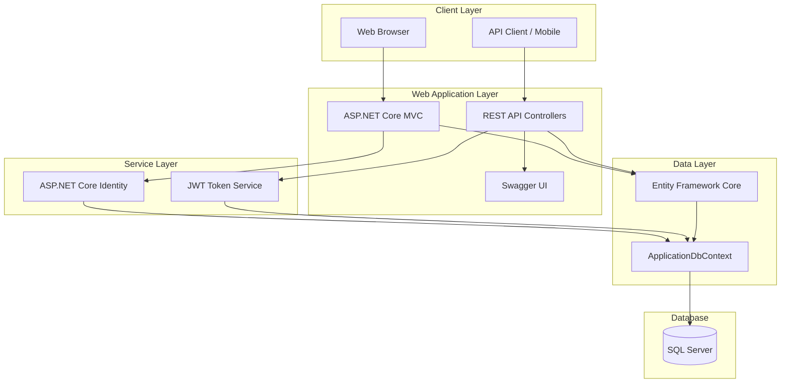
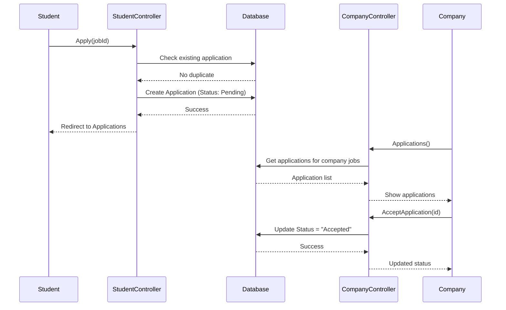
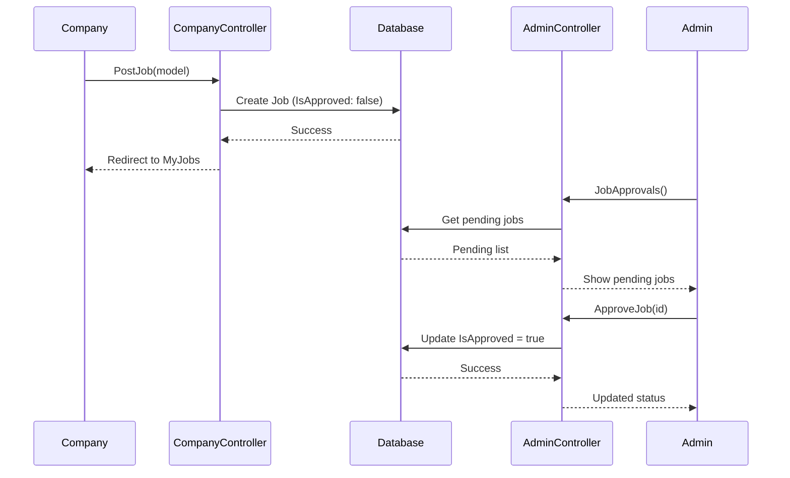
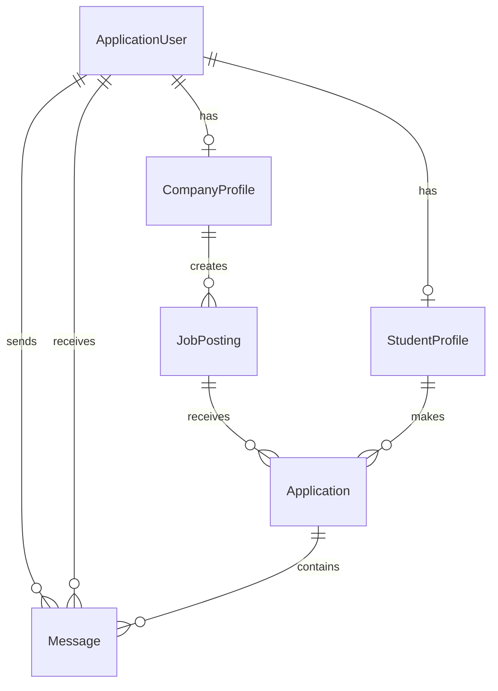

# StajPortal - System Architecture

## System Overview



## Component Breakdown

### Controllers (MVC)
| Controller | Dosya | İşlev | Durum |
|------------|-------|-------|-------|
| HomeController | `/Controllers/HomeController.cs` | Anasayfa, Privacy | ✅ |
| AccountController | `/Controllers/AccountController.cs` | Kayıt, Giriş, Çıkış | ✅ |
| StudentController | `/Controllers/StudentController.cs` | Öğrenci dashboard, profil, başvurular | ✅ |
| CompanyController | `/Controllers/CompanyController.cs` | Firma dashboard, ilanlar, başvurular | ✅ |
| AdminController | `/Controllers/AdminController.cs` | Admin dashboard, onaylar | ✅ |
| JobsController | `/Controllers/JobsController.cs` | İlan listeleme, detay | ✅ |

### API Controllers
| Controller | Dosya | Endpoint | Durum |
|------------|-------|----------|-------|
| AuthController | `/Controllers/Api/AuthController.cs` | `/api/auth/*` | ✅ |
| JobsApiController | `/Controllers/Api/JobsApiController.cs` | `/api/jobs/*` | ✅ |

### Models

#### Entities
| Entity | Dosya | Açıklama |
|--------|-------|----------|
| ApplicationUser | `/Models/Entities/ApplicationUser.cs` | Identity User + Role, FullName |
| StudentProfile | `/Models/Entities/StudentProfile.cs` | Öğrenci profil bilgileri |
| CompanyProfile | `/Models/Entities/CompanyProfile.cs` | Firma profil bilgileri |
| JobPosting | `/Models/Entities/JobPosting.cs` | Staj ilanları |
| Application | `/Models/Entities/Application.cs` | Başvurular |
| Message | `/Models/Entities/Message.cs` | Mesajlaşma (kullanılmıyor) |

#### DTOs (API için)
| DTO | Dosya | Kullanım |
|-----|-------|----------|
| LoginRequestDto | `/Models/DTOs/LoginRequestDto.cs` | API Login |
| RegisterRequestDto | `/Models/DTOs/RegisterRequestDto.cs` | API Register |
| AuthResponseDto | `/Models/DTOs/AuthResponseDto.cs` | API Auth Response |
| JobPostingDto | `/Models/DTOs/JobPostingDto.cs` | API Job Response |

#### ViewModels
| ViewModel | Dosya | Kullanım |
|-----------|-------|----------|
| LoginViewModel | `/Models/ViewModels/LoginViewModel.cs` | MVC Login |
| RegisterViewModel | `/Models/ViewModels/RegisterViewModel.cs` | MVC Register |
| JobPostingViewModel | `/Models/ViewModels/JobPostingViewModel.cs` | MVC Job Form |

### Views Structure
```
Views/
├── Account/         # Login, Register, AccessDenied
├── Admin/           # Dashboard, JobApprovals
├── Company/         # Dashboard, Profile, PostJob, MyJobs, EditJob, Applications
├── Home/            # Index, Privacy
├── Jobs/            # Index, Details
├── Student/         # Dashboard, Profile, Applications
└── Shared/          # _Layout, Error, _ValidationScriptsPartial
```

### Services
| Service | Interface | Dosya | İşlev |
|---------|-----------|-------|-------|
| JwtTokenService | IJwtTokenService | `/Services/` | JWT Token oluşturma |

## Data Flow

### Başvuru Akışı


### İlan Onay Akışı


## Integration Points

### Authentication
- **Cookie Authentication**: MVC için - 7 gün süreli
- **JWT Bearer Authentication**: API için - 24 saat süreli
- **Identity**: Kullanıcı yönetimi, şifre politikaları

### Database Relationships


## Architectural Decisions

### ADR-001: Role Property in User
- **Karar**: Role bilgisi hem Identity Claim hem de User entity'de tutulur
- **Sebep**: Policy-based authorization ve kolay erişim

### ADR-002: Separate Profiles
- **Karar**: StudentProfile ve CompanyProfile ayrı tablolar
- **Sebep**: Farklı veri yapıları, kolay yönetim

### ADR-003: Job Approval Workflow
- **Karar**: İlanlar admin onayı gerektirir
- **Sebep**: Spam ve uygunsuz içerik kontrolü

## Non-Functional Requirements

### Security
- CSRF koruması (ValidateAntiForgeryToken)
- Şifre gereksinimleri: 6+ karakter, büyük/küçük harf, rakam
- Hesap kilitleme: 5 başarısız → 5 dakika
- HTTPS

### Performance
- Entity Framework lazy loading
- Database indexler (IsActive, IsApproved, Status, IsRead)

### Scalability
- Stateless API design
- JWT token based authentication
