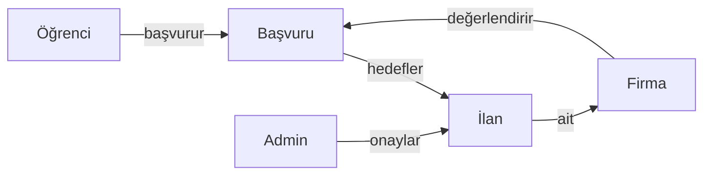

# StajPortal - Domain & Project Knowledge

## Domain Concepts

### Staj (Internship)
Üniversite öğrencilerinin belirli bir süre boyunca bir firmada çalışarak mesleki deneyim kazanması.

### Staj İlanı (Job Posting)
Firmaların stajyer adaylarını çekmek için yayınladığı pozisyon açıklaması. İçerir:
- Pozisyon başlığı
- Açıklama ve gereksinimler
- Departman
- Lokasyon (şehir)
- Süre (başlangıç-bitiş tarihleri)

### Başvuru (Application)
Öğrencinin bir staj ilanına yaptığı resmi talep. Durumları:
- **Pending** (Beklemede): Değerlendirme bekliyor
- **Accepted** (Kabul Edildi): Firma kabul etti
- **Rejected** (Reddedildi): Firma reddetti

### Kullanıcı Rolleri

| Rol | Açıklama | Yetkiler |
|-----|----------|----------|
| **Student** | Öğrenci | İlan görüntüleme, başvuru yapma, profil düzenleme |
| **Company** | Firma | İlan oluşturma/düzenleme, başvuru değerlendirme |
| **Admin** | Yönetici | İlan onaylama, kullanıcı yönetimi, tüm erişim |

## Relationship Map



## Key Resources

### Proje Dosyaları
- `/Controllers/` - MVC ve API controller'ları
- `/Models/Entities/` - Veritabanı entity'leri
- `/Views/` - Razor view'ları
- `/Data/ApplicationDbContext.cs` - EF Core context

### Referans Dokümantasyon
- [ASP.NET Core Documentation](https://docs.microsoft.com/aspnet/core)
- [Entity Framework Core](https://docs.microsoft.com/ef/core)
- [ASP.NET Core Identity](https://docs.microsoft.com/aspnet/core/security/authentication/identity)

## Project Best Practices

### Controller Conventions
```csharp
// GET: /Controller/Action
[HttpGet]
public IActionResult Action() { }

// POST: /Controller/Action
[HttpPost]
[ValidateAntiForgeryToken]  // CSRF koruması
public async Task<IActionResult> Action(Model model) { }
```

### Authorization
```csharp
// Policy-based authorization
[Authorize(Policy = "StudentOnly")]
public class StudentController : Controller { }

// Claim-based check
var claims = await _userManager.GetClaimsAsync(user);
if (!claims.Any(c => c.Type == "Role"))
{
    await _userManager.AddClaimAsync(user, new Claim("Role", user.Role));
}
```

### Feedback Messages
```csharp
// Başarı mesajı
TempData["Success"] = "İşlem başarılı!";

// Hata mesajı
TempData["Error"] = "Bir hata oluştu.";

// Uyarı mesajı
TempData["Warning"] = "Dikkat edilmesi gereken bir durum var.";
```

### API Response Format
```csharp
// Başarılı
return Ok(new { Success = true, Data = data, Message = "..." });

// Hata
return BadRequest(new { Success = false, Message = "..." });
return Unauthorized(new { Success = false, Message = "..." });
return NotFound(new { Success = false, Message = "..." });
```

## FAQ

### Q: Admin kullanıcı nasıl oluşturulur?
```text
Veritabanına doğrudan SQL ile veya uygulama üzerinden kayıt olarak Admin kullanıcı oluşturabilirsiniz.
Admin seed kodu kaldırılmıştır, manuel oluşturma gereklidir.
```

### Q: Yeni rol nasıl eklenir?
```text
1. Claim olarak eklemek yeterli
2. Program.cs'de policy tanımla
3. Controller'da [Authorize(Policy = "...")] kullan
```

### Q: İlan nasıl onaylanır?
```text
1. Admin hesabıyla giriş yap
2. Dashboard → İlan Onayları
3. Onayla veya Reddet butonlarını kullan
```

### Q: API'ye nasıl erişilir?
```text
1. POST /api/auth/login ile token al
2. Swagger UI'da Authorize butonuna tıkla
3. Token'ı yapıştır (Bearer prefix olmadan)
4. Korumalı endpoint'leri çağır
```

## Implicit Knowledge

### Database Naming
- Entity adları tekil (StudentProfile, JobPosting)
- DbSet adları çoğul (StudentProfiles, JobPostings)

### View Naming
- Controller adı = View klasörü (StudentController → Views/Student/)
- Action adı = View dosyası (Dashboard → Dashboard.cshtml)

### Authorization Flow
```
Request → Cookie/JWT Check → Claim Check → Policy Check → Action
```

### Error Handling
- MVC: ModelState.AddModelError + View return
- API: ActionResult<T> + specific status codes

### Circular Reference
API'de JSON serialize ederken döngüsel referans olabilir:
```csharp
.AddJsonOptions(options =>
{
    options.JsonSerializerOptions.ReferenceHandler = 
        ReferenceHandler.IgnoreCycles;
});
```

## Code Snippets

### Kullanıcı Bilgisi Alma
```csharp
var user = await _userManager.GetUserAsync(User);
if (user == null) return RedirectToAction("Login", "Account");
```

### Profil Getirme
```csharp
var student = await _context.StudentProfiles
    .FirstOrDefaultAsync(s => s.UserId == user.Id);
```

### İlan Filtreleme
```csharp
var jobs = await _context.JobPostings
    .Include(j => j.Company)
    .Where(j => j.IsActive && j.IsApproved)
    .OrderByDescending(j => j.CreatedAt)
    .ToListAsync();
```

### Başvuru Kontrolü
```csharp
var hasApplied = await _context.Applications
    .AnyAsync(a => a.JobPostingId == jobId && a.StudentId == studentId);
```
